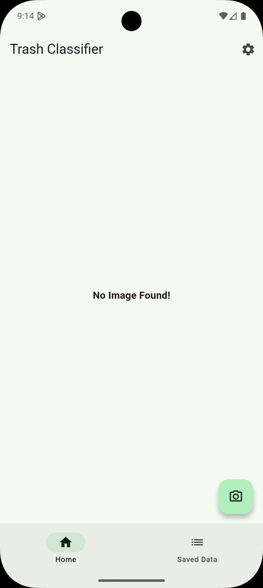
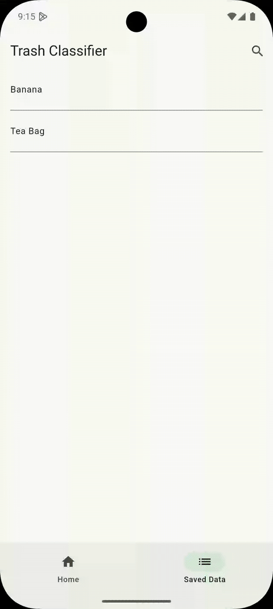

# ♻️Trash Classifier Application

A mobile application built with Flutter that helps users identify and categorize waste using a machine learning model. Snap a photo of any item, and the app will tell you whether it belongs in **Recycling**, **Compost**, **Garbage**, or another category - helping users make eco-friendly decisions.

##  Features

- **Image Capture**: Take photos of trash items using your device's camera, or directly from your gallery.
- **Machine Learning Integration**: Classifies trash using a TensorFlow Lite (TFLite) image classification model.
- **Save Entries**: Users can name and save their classifications for future reference.
- **View History**: View previously saved items and their categories.
- **Intuitive UI**: Simple and clean user interface built with Flutter.

## How It Works

1. User takes a picture of a trash item.
2. The app preprocesses the image and passes it to a pre-trained TFLite model.
3. The model returns a classification, e.g., "Recycling - Plastic", "Compost", "Garbage", etc.
4. The user can name and save the result to a local directory.
5. All saved items can be viewed later in the Saved Items section.

## Preview
### Image Capture + Saving 

  

### Searching for Images

  

